# qs-bitwarden-cli

Your Bitwarden vault in the **Omarchy** status bar. Search, copy, and manage
every item type without opening a browser.

[](LICENSE)
[](manifest.json)
[](https://omarchy.org/)
[](https://bitwarden.com/help/cli/)

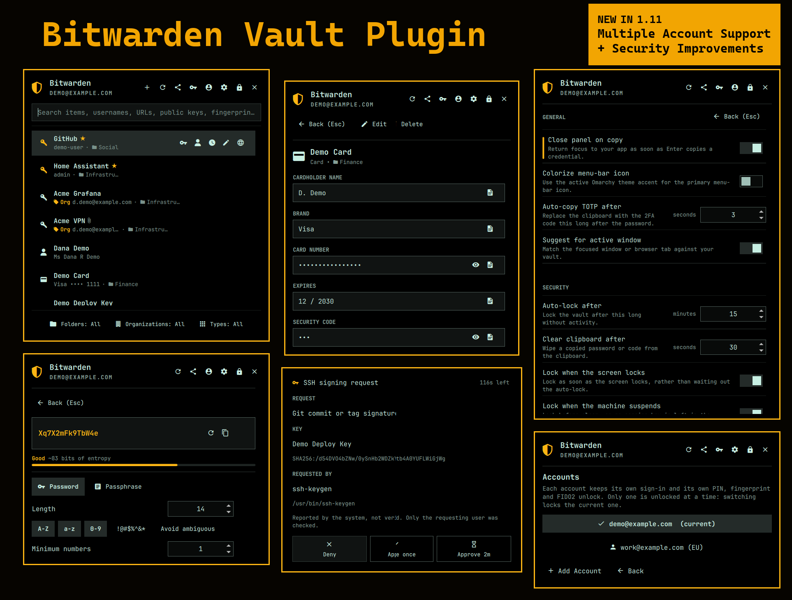

Built on Quickshell and the official Bitwarden CLI. Keyboard-first, fast, and
it never writes your vault to a cache of its own.

---

## Install

One command. It clones the plugin, enables it, and puts it in the bar:

```bash
omarchy plugin add https://github.com/Elevate08/qs-bitwarden-cli --enable
```

Nothing else has to be installed first. Open the panel and it tells you what it
still needs -- on a stock Omarchy install that is the Bitwarden CLI and `jq` --
with an **Install** button that hands off to Omarchy's own installer.

To update: `omarchy plugin update io.github.elevate08.qs-bitwarden-cli`

### Sign in

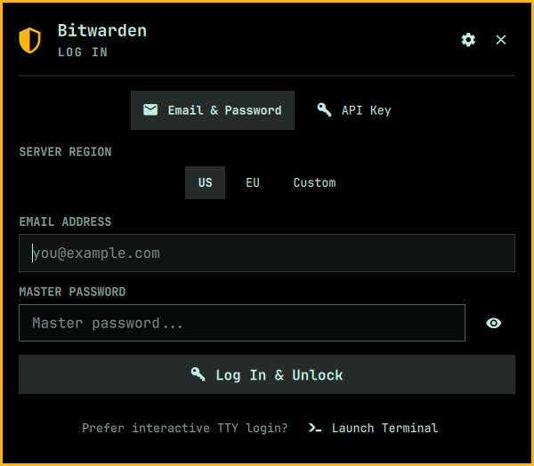

Email and password, with the 2FA prompt appearing only when Bitwarden asks for
one. **Server region** picks US, EU, or a custom URL for self-hosted Bitwarden
and Vaultwarden.

Using SSO, a Duo push, or a hardware key? **Launch Terminal** runs `bw login` in
a real terminal so Bitwarden's own prompts handle it, then hands the session
straight back to the panel -- no second login just to get in.

<br clear="all">

---

## The tour

### Your vault, one keystroke away


Search by name, username, URL, public key or fingerprint. <kbd>Enter</kbd>
copies the password and arms the TOTP follow-up; press it again within the
window and the live 2FA code replaces it on the clipboard.

Items show their folder and organization inline. The bottom bar filters by
folder, organization and type without leaving the keyboard.

**Suggestions** read the focused window or browser tab and pin the matching
credential to the top, so <kbd>Enter</kbd> is usually the only key you need.
Pick an item once for a site a title cannot match, and it is remembered.

<br clear="all">

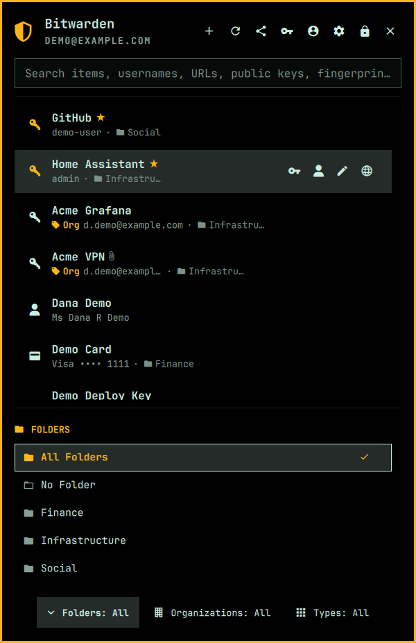

<kbd>f</kbd>, <kbd>o</kbd> and <kbd>t</kbd> open the folder, organization and
type drawers. Arrows move, <kbd>Enter</kbd> applies, <kbd>Esc</kbd> closes --
and the cursor starts on the option already in effect, so <kbd>Enter</kbd>
never changes anything by accident.

<br clear="all">

### Open an item

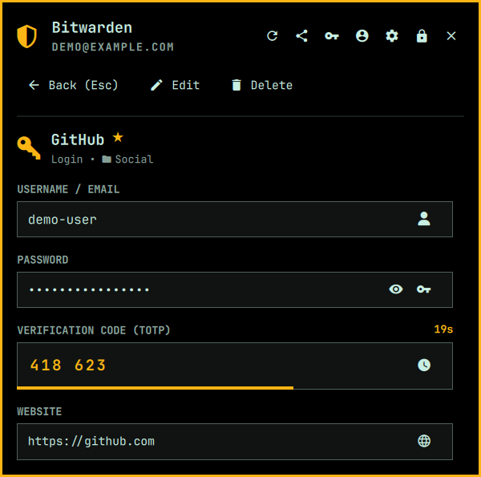

Username, password and the live TOTP with its countdown, the websites attached
to the item, its notes and any custom fields. Copy any of them with one key.

**Suggest here** pins this item for the app or site in front of you, so it is
offered outright next time rather than inferred.

<br clear="all">

### Every item type, not just logins

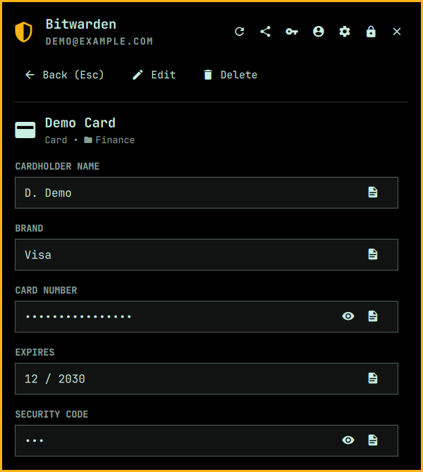

**Cards** show cardholder, brand, number, expiry and security code. The number
and the code are masked until revealed, and each reveals independently -- an eye
is a statement about the field it sits on.

Search finds a card by brand, cardholder, or last four digits. Deliberately not
by the middle of a number.

<br clear="all">

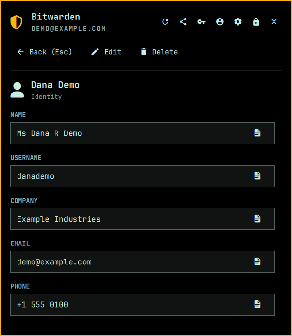

**Identities** show name, username, company, email and phone, the social
security, passport and licence numbers, and the address as a single copyable
block rather than seven rows. Empty fields are not drawn, so a sparse identity
stays short.

The three identifiers are masked for the reason a password is, with the
difference that these cannot be rotated afterwards.

<br clear="all">

### Add and edit, without waiting

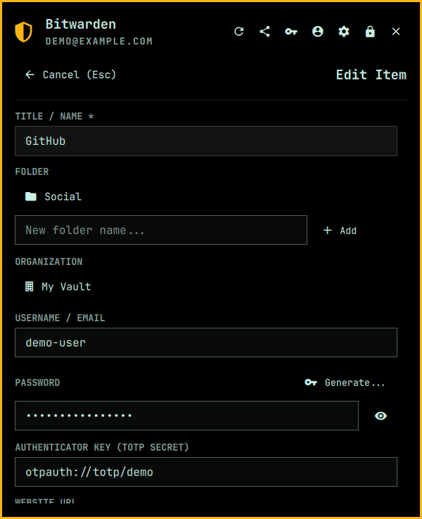

Create logins, secure notes, cards and identities. <kbd>Enter</kbd> saves from
anywhere in the form, so a long item does not have to be scrolled to the bottom.

Saving and deleting no longer hold the panel. The form closes as the command is
launched and the row shows a spinner until the vault answers. If the vault
refuses, the list goes straight back to what it actually holds and offers to
reopen what you typed.

<br clear="all">

### Generator

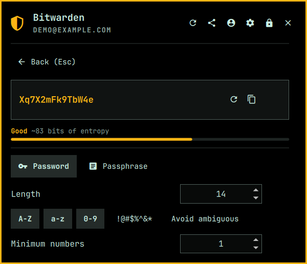

Every option the browser extension has -- length, character classes, minimums,
ambiguous characters, or a passphrase with a word count and separator -- with a
live strength meter.

Generation comes from Bitwarden's own generator, not a reimplementation, and
answers in about **2ms** rather than the ~2.9s a fresh `bw generate` costs.

<br clear="all">

### Send

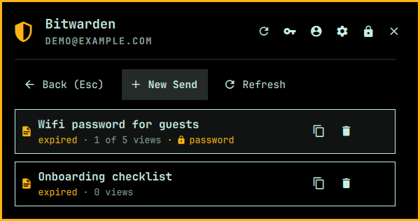

Share a secret through a link that expires on its own, so a credential need not
live in a chat log. Set a deletion window, a view limit and an optional
password; the link is copied the moment it is created.

<br clear="all">

### SSH agent

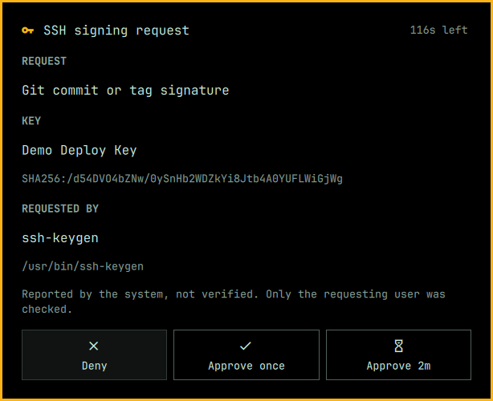

Opt-in. Serves the SSH keys in your vault to `ssh`, Git and `ssh-keygen -Y sign`
while the vault is unlocked, from a helper process that holds the private keys
in memory -- never on disk, never in QML.

Every signature names the key, its fingerprint and the program asking. One
approval can cover a whole rebase; live grants are listed and revocable.

**[Setup, verification and threat model →](docs/ssh-agent.md)**

<br clear="all">

### Settings

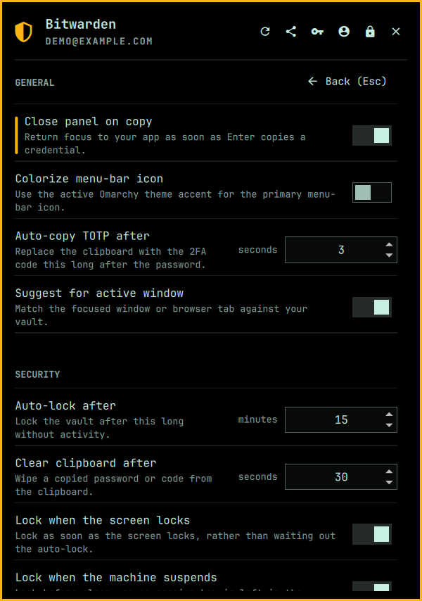

Grouped into **General**, **Security** and **SSH Agent**, with the section you
are reading pinned above the list as you scroll. Destructive actions sit under
their own **DANGER ZONE** heading.

Changes are written to the plugin's entry in `~/.config/omarchy/shell.json`
through `omarchy bar set`, so Omarchy owns the file and the shell hot-reloads.

The General settings include **Colorize menu-bar icon**, which makes the
primary Bitwarden shield follow the active Omarchy theme accent. It is off by
default; lock and setup/error indicators keep their existing status colors.

<br clear="all">

---

## How it compares

What this plugin does, next to the two official Bitwarden clients a Linux user
would otherwise reach for. Checked against Bitwarden's documentation on 2026-12-01.

| | This plugin | Bitwarden CLI | Bitwarden Desktop |
| :--- | :---: | :---: | :---: |
| **Lives in the Omarchy bar** | ✅ | ❌ | ❌ |
| View logins, notes, cards, identities | ✅ | ✅ | ✅ |
| Create / edit logins, notes, cards, identities [^cli-json] | ✅ | ✅ | ✅ |
| View SSH key items | ✅ | ✅ | ✅ |
| Create / import SSH keys [^adr] [^ssh-clients] | ❌ | ❌ | ✅ |
| **SSH agent** [^ssh-desktop] | ✅ | ❌ | ✅ |
| TOTP codes, auto-copied after the password [^totp] | ✅ | ❌ | ❌ |
| Download attachments | ✅ | ✅ | ✅ |
| Bitwarden Send, text | ✅ | ✅ | ✅ |
| Folders, collections, organizations | ✅ | ✅ | ✅ |
| Password / passphrase generator | ✅ | ✅ | ✅ |
| **Unlock with PIN** [^pin] | ✅ | ❌ | ✅ |
| **Unlock with fingerprint** [^fp] [^bio] [^bio-linux] | ✅ | ❌ | ✅ |
| Auto-lock on idle, screen lock, suspend [^cli-lock] [^desk-lock] | ✅ | ❌ | ✅ |
| **Suggests by focused window / browser tab** | ✅ | ❌ | ❌ |
| Self-hosted and Vaultwarden | ✅ | ✅ | ✅ |
| Import / export your vault [^io] | ❌ | ✅ | ✅ |
| Trash: restore a deleted item [^trash] | ❌ | ✅ | ✅ |
| Upload attachments [^attach] | ❌ | ✅ | ✅ |
| File Sends [^filesend] | ❌ | ✅ | ✅ |
| Edit custom fields [^fields] | ❌ | ✅ | ✅ |
| Organization admin: confirm members, approve devices [^orgadmin] | ❌ | ✅ | ❌ |

[^cli-json]: The CLI creates a login by default; other types need the JSON
    edited before encoding, as its documentation describes -- "use a
    command-line JSON processor like jq to change a `.type=` attribute to
    create other item types."
[^adr]: **This plugin** will not. The CLI can encrypt a type-5 item, but
    generating a key means putting private material somewhere this plugin has
    deliberately kept it out of.
    See [ADR 0004](docs/decisions/0004-ssh-key-creation.md).
[^ssh-clients]: Bitwarden documents SSH keys as generated or imported "using
    the desktop app, web app, and browser extension", and generation is
    Ed25519 only.
[^ssh-desktop]: Bitwarden's SSH agent is a desktop-app feature; the CLI does
    not provide one.
[^pin]: PIN unlock is documented for "mobile apps, browser extensions, and
    desktop apps".
[^fp]: **This plugin** verifies through the same PAM stack as the Omarchy lock
    screen, so it works wherever `omarchy setup security fingerprint` has been
    run.
[^bio]: Biometric unlock is documented for the desktop app, browser extensions
    and mobile apps -- not the CLI.
[^bio-linux]: On Linux the desktop app's biometric unlock goes through a polkit
    agent rather than a fingerprint reader directly.
[^totp]: All three read TOTP codes -- `bw get totp` on the CLI. The check
    here is for the follow-up: <kbd>Enter</kbd> copies the password and then
    replaces it with the live code a few seconds later, so a login and its
    second factor are one keystroke apart.
[^cli-lock]: The CLI has `bw lock`, but no timeout of its own -- a session key
    stays valid until something locks it.
[^desk-lock]: The desktop app offers time passed, on system idle, on system
    sleep, on system lock and on restart.

[^io]: `bw import` and `bw export` on the CLI; the desktop app has both in its
    UI. This plugin has neither -- it reads and writes single items, and a
    vault export is a different kind of operation from the one it is for.
[^trash]: A delete here is a delete. Bitwarden keeps deleted items in a trash
    for 30 days and both official clients can restore from it (`bw restore`);
    this plugin shows no trash and cannot restore.
[^attach]: This plugin downloads attachments but cannot add one. The CLI has
    `bw create attachment --file`.
[^filesend]: This plugin creates text Sends only. Both official clients send
    files too -- `bw send -f <path>`.
[^fields]: This plugin shows an item's custom fields but does not edit them.
[^orgadmin]: `bw confirm` and `bw device-approval` are CLI features; the
    desktop app does not do this either, and it is otherwise the web vault's
    job. Listed because the CLI is genuinely ahead of both here.

Sources: [CLI](https://bitwarden.com/help/cli/) ·
[SSH agent](https://bitwarden.com/help/ssh-agent/) ·
[About SSH](https://bitwarden.com/help/about-ssh/) ·
[PIN unlock](https://bitwarden.com/help/unlock-with-pin/) ·
[Biometrics](https://bitwarden.com/help/biometrics/)

---

## Usage & Keyboard Shortcuts

The panel opens with the item list focused, so single-letter shortcuts work straight away. Press <kbd>/</kbd> to type a search.

**While the search box has focus** every letter is search text -- as a text field should behave. Hold <kbd>Alt</kbd> to reach the same shortcuts without leaving the box or disturbing your query; <kbd>↓</kbd> also hands focus back to the list.

### Vault List View (Main Screen)

| Shortcut | Action |
| :--- | :--- |
| <kbd>Enter</kbd> | Copy password (and arm the TOTP follow-up), or open the item when there is no password to copy -- a card, an identity, a note, an SSH key |
| <kbd>Enter</kbd> *(again)* | Copy the TOTP code during the follow-up window |
| <kbd>↑</kbd> / <kbd>↓</kbd> / <kbd>j</kbd> / <kbd>k</kbd> | Move through items, or through an open filter drawer |
| <kbd>/</kbd> | Focus the search box |
| <kbd>Tab</kbd> / <kbd>Shift+Tab</kbd> | Cycle types without opening the drawer |
| <kbd>p</kbd> *(or <kbd>y</kbd>)* | Copy **p**assword |
| <kbd>u</kbd> *(or <kbd>c</kbd>)* | Copy **u**sername / email |
| <kbd>m</kbd> | Copy TOTP **m**ulti-factor code |
| <kbd>w</kbd> | Open the **w**ebsite in your browser |
| <kbd>e</kbd> | Open the detail inspector / **e**dit |
| <kbd>f</kbd> | **F**olders filter |
| <kbd>o</kbd> | **O**rganizations filter |
| <kbd>t</kbd> | **T**ypes filter |
| <kbd>g</kbd> | **G**enerator |
| <kbd>n</kbd> | **N**ew vault item |
| <kbd>s</kbd> | **S**ettings |
| <kbd>r</kbd> | Sync (**r**efresh) |
| <kbd>l</kbd> | **L**ock the vault |
| <kbd>Alt</kbd>+<kbd>s</kbd> | Bitwarden **S**end |
| <kbd>Alt</kbd>+<kbd>,</kbd> | Settings |
| <kbd>Esc</kbd> | Close the filter drawer, clear the search, or close the panel |

`Alt` + any letter above runs the same action from inside the search box. Two are `Alt`-only: <kbd>Alt</kbd>+<kbd>s</kbd> opens **Send** (which has no bare letter, since <kbd>s</kbd> is Settings), and <kbd>Alt</kbd>+<kbd>,</kbd> opens **Settings**, so Settings is still reachable while searching.

### Detail Inspector

| Shortcut | Action |
| :--- | :--- |
| <kbd>Enter</kbd> / <kbd>y</kbd> / <kbd>p</kbd> | Copy what the item is for: the password on a login, the number on a card |
| <kbd>u</kbd> / <kbd>c</kbd> | Copy username; on an identity <kbd>u</kbd> is the username and <kbd>c</kbd> the email |
| <kbd>n</kbd> | Copy a card's **n**umber |
| <kbd>k</kbd> | Copy a card's security code |
| <kbd>m</kbd> | Copy TOTP code |
| <kbd>v</kbd> | Toggle re**v**eal on the item's principal secret -- the password on a login, the number on a card. Every other masked field has its own eye, and each reveals independently |
| <kbd>a</kbd> | Save every **a**ttachment on this item |
| <kbd>e</kbd> | Edit this item |
| <kbd>x</kbd> | Delete this item (asks first) |
| <kbd>b</kbd> / <kbd>q</kbd> / <kbd>Esc</kbd> | Back to the list |

### Filter Drawer (Folders / Organizations / Types)

| Shortcut | Action |
| :--- | :--- |
| <kbd>f</kbd> / <kbd>o</kbd> / <kbd>t</kbd> | Open (or close) that drawer |
| <kbd>↑</kbd> / <kbd>↓</kbd> | Move through the options |
| <kbd>Enter</kbd> | Apply the highlighted option |
| <kbd>Esc</kbd> | Close without changing anything |

The cursor starts on the option already in effect, so <kbd>Enter</kbd> never changes a filter by accident.

### Settings Screen

| Shortcut | Action |
| :--- | :--- |
| <kbd>↑</kbd> / <kbd>↓</kbd> | Move between settings |
| <kbd>←</kbd> / <kbd>→</kbd> | Decrease / increase a number by its step, or switch a toggle off / on |
| <kbd>Enter</kbd> | Flip the highlighted toggle, or open the PIN / fingerprint form |
| <kbd>Esc</kbd> | Back |

### Send Screen

| Shortcut | Action |
| :--- | :--- |
| <kbd>Alt</kbd>+<kbd>s</kbd> | Open Sends |
| <kbd>n</kbd> | New Send |
| <kbd>r</kbd> | Refresh the list |
| <kbd>x</kbd> | Delete the highlighted Send |
| <kbd>Enter</kbd> | Copy the highlighted Send's link |
| <kbd>Esc</kbd> | Back |

---

---

## Optional features

### PIN unlock

Turn on **Unlock with PIN** in the settings screen. You are asked for your master password once (it is needed to encrypt) and for a PIN. Six digits or more is what the screen asks for; four and five are accepted but shown in red with the number of combinations spelled out, so a weak PIN is a decision rather than an accident.

**How it differs from fingerprint unlock.** Fingerprint unlock keeps your master password in the login keyring in the clear, because PAM can only prove presence. A PIN can do better: the master password is encrypted with a key derived from the PIN (PBKDF2-SHA256, 600,000 iterations, salted) and only the ciphertext is stored, so reading the keyring is not by itself enough. A wrong PIN fails decryption, which means correctness needs no stored hash and there is no hash to attack.

**The honest limit.** A short PIN is a small search space, and if the ciphertext leaks, the iteration count is the only thing standing between an attacker and your master password. Five wrong attempts at the panel deletes the stored ciphertext, but that is a UI throttle and does nothing against an offline attack on a copy of the blob. Concretely: 4 digits is 10,000 candidates, which is minutes of offline guessing even at 600,000 PBKDF2 rounds each; 6 digits is 1,000,000, and 8 is 100,000,000. Pick accordingly.

The stored ciphertext is removed when you turn the setting off, after five wrong attempts, or when the vault rejects the decrypted password (for example after a master password change).

### Fingerprint unlock

Set `fingerprintUnlock` to `true` to unlock the vault with a finger instead of your master password.

**Requirements**

- A fingerprint reader with at least one enrolled finger, configured through `omarchy setup security fingerprint`. The plugin verifies all of this itself (`/etc/pam.d/omarchy-lock-fingerprint`, `fprintd-list`) and silently stays hidden when any part is missing.
- A running, unlocked OS keyring, as used by `rememberSession`. Omarchy ships libsecret itself, so there is nothing to install for this.

**How it works**

1. Switch **Unlock with fingerprint** on in the settings screen. It asks for your master password once -- the same way setting a PIN does -- and stores it in the login keyring under `service=qs-bitwarden-cli, account=master_password`.
2. On every later lock, opening the panel arms the reader. A verified fingerprint releases the stored password to `bw unlock`; the password field remains available as a fallback at all times.
3. Unlocking with your master password afterwards refreshes the stored copy, so changing your master password does not silently strand the enrolment.

**Security trade-off -- read before enabling**

PAM can prove that you are present, but it cannot produce your Bitwarden master password, and `bw unlock` accepts nothing else. Fingerprint unlock therefore keeps your master password in the OS login keyring and treats a verified fingerprint as the gate on reading it back. This is the same trade the official Bitwarden desktop client makes for its own biometric unlock, and it means **anyone who can read your unlocked login keyring can read your master password**. It is off by default and worth leaving off on a shared or unattended machine.

The stored password is removed when you turn the setting off, press **Forget Fingerprint** on the locked screen, log out of the account, or when the vault rejects it (for example after a master password change, which then prompts you for the new one).

### SSH agent

Off by default. See **[docs/ssh-agent.md](docs/ssh-agent.md)** for setup, the
provenance check, and what the agent does and does not protect.

---

## Bar placement

`--enable` already puts the widget in the bar. To move it:

```bash
omarchy bar move io.github.elevate08.qs-bitwarden-cli --section right
```

Settings are editable from the panel's own settings screen, or directly in
`~/.config/omarchy/shell.json`. Each setting lives **inline on the bar entry**,
not in a separate block:

```json
{
  "bar": {
    "layout": {
      "right": [
        {
          "id": "io.github.elevate08.qs-bitwarden-cli",
          "autoLockMinutes": 15,
          "lockOnScreenLock": true,
          "lockOnSuspend": true,
          "clearClipboardSec": 30,
          "rememberSession": true,
          "fingerprintUnlock": false,
          "sshAgentEnabled": false,
          "sshAgentApprovalPopup": true
        }
      ]
    }
  }
}
```

## Global hotkey

To toggle the Bitwarden panel with a keyboard shortcut (e.g. `SUPER + CTRL + /`), add the binding to `~/.config/hypr/bindings.lua`:

```lua
o.bind("SUPER + CTRL + SLASH", "Bitwarden vault", "omarchy-shell io.github.elevate08.qs-bitwarden-cli toggle")
```

Apply changes by restarting the shell:

```bash
omarchy restart shell
```

---

## Configuration Reference

The following settings are read from the plugin's own entry in the
`bar.layout` array of `~/.config/omarchy/shell.json` -- inline alongside its
`id`, as shown above. The panel's settings screen writes them for you via
`omarchy bar set`, so editing the file by hand is optional:

| Key | Type | Default | Description |
| :--- | :--- | :--- | :--- |
| `autoLockMinutes` | `number` | `15` | Minutes of inactivity before automatically locking the vault (`0` to disable). Range `0`-`1440`; out of range is clamped and an unreadable value falls back to `15`. |
| `clearClipboardSec` | `number` | `30` | Seconds before automatically clearing copied secrets from the clipboard (`0` to disable). Range `0`-`300`; out of range is clamped and an unreadable value falls back to `30`. |
| `lockOnScreenLock` | `boolean` | `true` | Lock the vault as soon as the screen locks, rather than waiting out `autoLockMinutes`. Reads the Omarchy lock screen's own state, so it follows a manual lock and an idle lock alike. A shell without the lock plugin simply never reports a lock; it is never read as one. |
| `lockOnSuspend` | `boolean` | `true` | Lock the vault when the machine is going to sleep, so no unlocked session key is left in the suspended machine's memory. Holds a `delay` sleep inhibitor for about a second so the lock finishes first. Needs `gdbus` (glib2) and `systemd-inhibit`; without them the setting is simply inert. |
| `rememberSession` | `boolean` | `true` | Persist session token in OS keyring (`secret-tool`) while unlocked. Survives a shell restart, never a reboot -- see the note above. |
| `autoCopyTotpSec` | `number` | `3` | Seconds after password copy to automatically replace clipboard with TOTP code (`0` to disable). Range `0`-`30`; out of range is clamped and an unreadable value falls back to `3`. |
| `closeOnCopy` | `boolean` | `true` | Automatically close panel on Enter copy so target application receives focus immediately. |
| `suggestOnOpen` | `boolean` | `true` | Automatically suggest matching vault items for the active window or browser tab on open. |
| `fingerprintUnlock` | `boolean` | `false` | Unlock the vault with an enrolled fingerprint. Stores your master password in the OS login keyring -- see [Optional: Fingerprint Unlock](#fingerprint-unlock). |
| `pinUnlock` | `boolean` | `false` | Unlock with a numeric PIN. Stores the master password encrypted under a PIN-derived key -- see [Optional: PIN Unlock](#pin-unlock). |
| `sshAgentEnabled` | `boolean` | `false` | Serve your vault's SSH keys to `ssh`, Git and signing while the vault is unlocked. Starts a helper process and a socket under `$XDG_RUNTIME_DIR`; private keys stay in that helper and are dropped on lock -- see [SSH Agent](docs/ssh-agent.md). |
| `sshAgentUnlockOnDemand` | `boolean` | `false` | Let an identity listing raise the unlock prompt when the vault is locked and no keys have been loaded yet, instead of answering with an empty list. Signing a key the helper already knows always raises the prompt, with or without this. Off by default: `ssh` asks the agent for identities on every connection, so this raises the configured approval surface on the first `ssh` after every login. |
| `sshAgentApprovalPopup` | `boolean` | `true` | Show SSH unlock and signing requests in a transient card in the middle of the screen instead of opening the anchored panel. Disable to show prompts in the panel. Multiple concurrent requests are queued sequentially with a "1 of N" counter and "Deny all" option. Escape and outside click deny. |
| `sshAgentApprovalWindowSec` | `number` | `120` | How long one approval keeps covering further signatures from the same program with the same key. Range `0`-`900`; `0` asks every time. Held in memory only and dropped on lock, logout or exit. |

One further key, `twoFactorMethods`, is written to the same entry but is not a
setting you configure. It records which two-step method last logged each
account in, keyed by login address -- `{"you@example.com": 0}`, where `0` is
authenticator, `1` email and `3` YubiKey -- so an account with more than one
method is asked only once, and two vaults on one machine each keep their own
answer. **Change method** on the code screen asks again and rewrites it. Entries
are capped at ten accounts, and anything unreadable is treated as not
remembered, which costs that account one extra prompt.

Learned suggestions are stored separately in `~/.local/state/qs-bitwarden-cli/associations.json`. Delete that file to reset everything the panel has learned; logging out deletes it for you.

---

---

## IPC & Scripting Interface

You can control and query the Bitwarden plugin from the terminal, scripts, or window manager bindings. The form is `omarchy-shell <target> <method>`:

```bash
# Show, hide, or toggle the popup panel
omarchy-shell io.github.elevate08.qs-bitwarden-cli open
omarchy-shell io.github.elevate08.qs-bitwarden-cli close
omarchy-shell io.github.elevate08.qs-bitwarden-cli toggle

# Jump straight to a screen
omarchy-shell io.github.elevate08.qs-bitwarden-cli settings     # -> "settings"
omarchy-shell io.github.elevate08.qs-bitwarden-cli setup        # -> "setup" (dependency wizard)

# Lock the vault immediately
omarchy-shell io.github.elevate08.qs-bitwarden-cli lock         # -> "locked"

# Sync with Bitwarden
omarchy-shell io.github.elevate08.qs-bitwarden-cli sync         # -> "syncing"

# Query vault state
omarchy-shell io.github.elevate08.qs-bitwarden-cli status       # -> "unlocked" | "locked" | "unauthenticated"
```

`open`, `close` and `toggle` return nothing; the rest echo the state they moved to.

Omarchy's shell-level dispatcher also toggles any plugin, and works equally well for a keybinding:

```bash
omarchy-shell shell toggle io.github.elevate08.qs-bitwarden-cli
```

Only `toggle` exists at that level, though -- `omarchy-shell shell open|close <id>` answers `Function not found`, and `omarchy-shell shell call <id> <method> '{}'` answers `unknown`. Use the plugin-target form above for everything other than toggling.

The same calls work through Quickshell directly, which is useful when `omarchy-shell` is not on `PATH`:

```bash
qs -p /usr/share/omarchy/shell/shell.qml ipc call io.github.elevate08.qs-bitwarden-cli status
```

---

---

## Dependencies

The helper's crates are updated by Dependabot under `versioning-strategy:
lockfile-only`, so a proposed bump only ever moves `agent/Cargo.lock` within
the bounds `agent/Cargo.toml` already allows. Crossing a major is a manual
edit, on purpose: several of the version floors in that manifest exist to keep
one copy of the RustCrypto traits in the graph, and Dependabot raising them
one at a time is what broke the build in PR #11.

**The crypto stack moves together or not at all.** `ssh-key` and `rsa`
re-export the trait generation their callers must match, and `agent/src/lib.rs`
calls those traits directly -- `Verifier::verify`, `try_sign`,
`pkcs1v15::SigningKey`. Bump one crate without the others and cargo resolves
two versions side by side, at which point the traits stop unifying and
nothing compiles. The coupled set is `ssh-key`, `ssh-encoding`,
`ed25519-dalek`, `rsa`, `signature`, `sha2`/`digest`, `zeroize` and
`rand_core`; Dependabot groups them under `crypto` for the same reason.

As of 2026-08-31 that upgrade is gated upstream: `ssh-key` is at `0.7.0-rc.11`
and `rsa` at `0.10.0-rc.18`, both still pre-release, and the stable releases
still pin the older generation. When they land, raise every crate in the set
in one commit and expect real source changes, not just a manifest edit.
Nothing will prompt you -- there are no `ignore` conditions to trip, because
cargo's own semver rules already hold `0.10` back from `0.11`.

Every accepted bump, major or not, changes the shipped bytes and so needs the
binary rebuilt in the same change -- see the `needs-binary-rebuild` label:

```bash
gh pr checkout <n>
./scripts/build-agent.sh    # re-enters the digest-pinned image
git commit -am "deps: rebuild the agent binary" && git push
```

CI never does this for you. `--compare-tracked` proves the committed bytes are
what the committed source builds; it cannot tell you whether that source is
trustworthy, and a malicious crate builds just as reproducibly as an honest
one. Reading the `Cargo.lock` diff before you commit the binary is the only
check that covers that, which is why the rebuild stays a human step.

---

---

## More

- **[Features in detail](docs/features.md)** -- every feature and why it works the way it does.
- **[SSH agent](docs/ssh-agent.md)** -- setup, verification, threat model.
- **[Uninstall](docs/uninstall.md)** -- including what to clear before removing the plugin.
- **[Development](docs/development.md)** -- linting and the test suite.
- **[Decisions](docs/decisions/)** -- the arguments that were had once and should not drift.

---

## License

MIT -- see [LICENSE](LICENSE).
